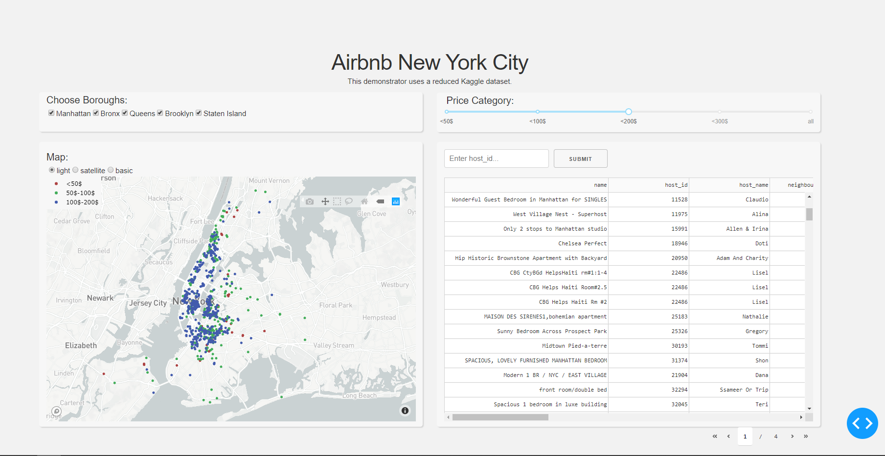
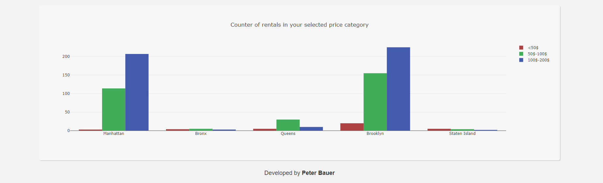

# New York City Airbnb 
Interactive data visualization with Dash by [Plotly](https://plot.ly/).

## Build with
- [Python](https://www.python.org/) - Main scripting language
- [Dash](https://dash.plot.ly/) - Server and interactive components
- [Plotly Python](https://plot.ly/python/) - For interactive plots


## Getting Started 

### Run on local server
Create a virtual enviroment inside a folder and activate it
```
> python -m venv my_env

> my_env\Scripts\activate.bat
```
Clone the repository to your directory and install the requirements.txt
```
> git clone https://github.com/ptr-br/NYC-Airbnb-Dashboard.git

> cd NYC-Airbnb-Dashboard

> pip install -r requirements.txt
```
Execute the application
```
> python app.py
```

## About the app
This app displays Airbnb rentals in New York Ctiy. Choose your boroughs and a price to show off only the possibilities you can afford.

## Snapshots
Get an impression of the appliction without using it by yourself.







  
  
  
